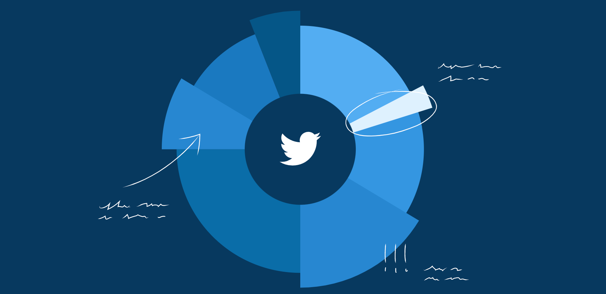

# Twitter Analysis

    
    &nbsp;&nbsp;

## Analysing famous CEO's tweets

This repository contains a small project which scrapes the twitter accounts from 5 famous CEOs in the tech industry:

- Elon Musk
- Tim Cook
- Bill Gates
- Sundar Pichai

## Tools.

- Python
- Pandas
- snscrape [github](https://github.com/JustAnotherArchivist/snscrape)

<<<<<<< HEAD
## Results.
=======
## Results.
>>>>>>> 928b62cabf7e13ee20e7f1827903a3ff6bd9bcf8

- For the main notebook with the analysis process and code, see [main.ipynb](main.ipynb)
- For a slideshow presentation of the results, see [2022-05-27_findings.pdf](2022-05-27_findings.pdf)
